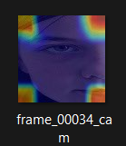
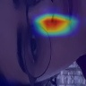
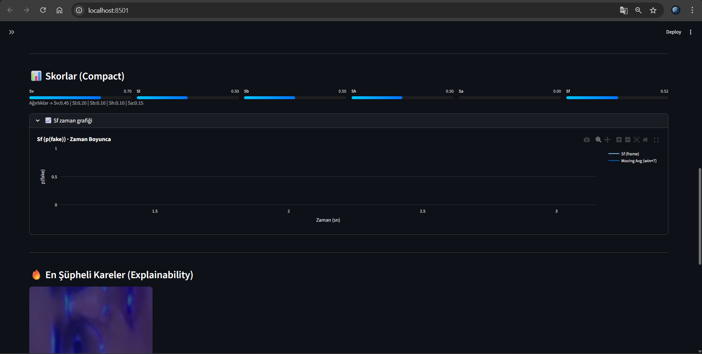

# 🎭 Multimodal Deepfake Detection System  
**Vision • Audio • Lip-Sync • Explainability • LLM Support**

Bu proje, **deepfake videolarını çoklu modalite (görüntü + ses + dudak-ses senkronu)** üzerinden analiz eden, **açıklanabilir (XAI)** ve **uçtan uca çalışan** bir yapay zeka sistemidir.

Amaç yalnızca *“fake mi?”* demek değil,  
**“neden fake / neden gerçek?”** sorusuna **kanıta dayalı açıklama** üretmektir.

---
## 🎯 Multimodal Deepfake Tespit Sistemi — Vitrin

> 📌 Aşağıda sunulan tüm görseller ve çıktılar, geliştirilen multimodal deepfake tespit sisteminin **gerçek zamanlı çalışması sırasında elde edilen çıktılardır**.

---

---

### 🖥️ 1) Arayüz (UI)
Sistem, yüklenen video için görsel, işitsel ve senkronizasyon analizlerini paralel olarak çalıştırır ve sonuçları tek bir panelde sunar.

<p align="center">
  
</p>

---


---

## 🔍 2) Explainability — Grad-CAM
CNN tabanlı görsel modelin karar verirken odaklandığı yüz bölgeleri Grad-CAM ile görselleştirilir.  
Isı haritaları, modelin şüpheli bölgeleri nasıl tespit ettiğini açıklar.

<p align="center">
  
  
</p>
<p align="center">
  <em>Sol: Deepfake örneği — Sağ: Gerçek (BEN)</em>
</p>

---

#### 👄 3) Ağız Kareleri (BN vs DF)
Gerçek (**BN**) ve deepfake (**DF**) videolardan çıkarılan ağız bölgesi kareleri.  
Dudak senkronizasyonundaki tutarsızlıklar görsel olarak karşılaştırılır.

<p align="center">
  
  
</p>

<p align="center">
  <em>Sol: Gerçek (BN) — Sağ: Deepfake (DF)</em>
</p>


---

### 🧠 4) LLM Yorumları (Neden Deepfake?)
Model çıktıları, büyük dil modeli (LLM) tarafından yorumlanarak  
<strong>“neden deepfake?”</strong> sorusuna insan-dostu açıklamalar üretir.  
Ayrıca hangi analiz çıktısının LLM’e yönlendirildiği gösterilir.

<p align="center">
  
</p>

<p align="center">
  
</p>

<p align="center">
  <em>LLM yönlendirme ve açıklama üretim akışı</em>
</p>

---

### 📄 5) PDF Çıktısı (Otomatik Rapor)
Analiz sonuçları otomatik olarak PDF raporu şeklinde dışa aktarılır.

<p align="center">
  
</p>

<p align="center">
  <em>Otomatik oluşturulan analiz raporu (PDF)</em>
</p>
---

### 📊 6) Parametre Grafikleri
Skorlar ve eşik değerleri grafiksel olarak sunularak model davranışı şeffaflaştırılır.

<p align="center">
  
</p>

---

## 🎥 7) Demo (Uçtan Uca)
Gerçek zamanlı çalışan sistemin uçtan uca kullanımını gösteren örnek demo.

👉 [Demo videosunu izlemek için tıklayın](screenshots/demo_videosu.mp4)

---
## 🧠 Sistem Mimarisi

```text
Video Input
   ├── Visual Analysis (CNN + Grad-CAM)
   ├── Audio Analysis (ASR + Artefact Detection)
   ├── Lip-Sync Analysis (Mouth / Audio Alignment)
   └── LLM-based Explanation
            ↓
        Fusion Layer
            ↓
   Final Deepfake Probability + Explanation
```

---

## 🔍 Modaliteler

### 🎥 Görüntü (Visual)
- CNN / Xception tabanlı model  
- Frame-level analiz  
- Grad-CAM ile açıklanabilirlik  

### 🔊 Ses (Audio)
- ASR tabanlı çözümleme  
- GAN artefakt analizi  

### 👄 Dudak–Ses Senkronu
- Ağız bölgesi tespiti  
- Audio–visual hizalama  

### 🧠 LLM Yorumlama
- Skorların metinsel açıklaması  
- “Neden fake / neden gerçek?” cevabı  

---

## 📂 Proje Yapısı

```bash
deepfake_project/
├── src/
│   ├── app.py
│   ├── media_io.py
│   ├── visual_model.py
│   ├── visual_score.py
│   ├── gradcam_utils.py
│   ├── audio_artefact.py
│   ├── asr_text.py
│   ├── lip_sync.py
│   ├── mouth_detect.py
│   ├── mouth_embed.py
│   ├── fusion.py
│   ├── llm_client.py
│   └── biomech.py
│
├── network/models/
├── assets/demo.mp4
├── sample_data/
├── server.py
├── run_demo.py
├── rag_knowledge.json
├── requirements.txt
└── README.md
```

---

## ⚙️ Kurulum

```bash
pip install -r requirements.txt
```

## ▶️ Çalıştırma

```bash
streamlit run src/app.py
```

---

## 📊 Çıktılar

- Final deepfake skoru (0–1)  
- Modalite bazlı skorlar  
- Görsel açıklamalar  
- Metinsel gerekçe  

---

## 👩‍💻 Geliştirici

**Büşra Mina Al**  
Artificial Intelligence & Industrial Engineering  
Ostim Teknik Üniversitesi

---

> Trustworthy AI requires explainable decisions.


https://github.com/busraminal/Multimodal-Deepfake-Tespit-Sistemi/raw/main/assets/demo.mp4

